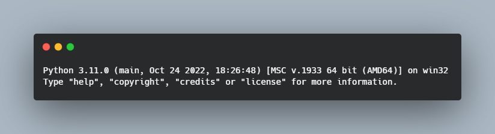
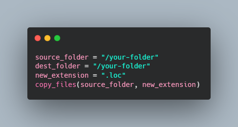
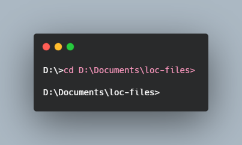
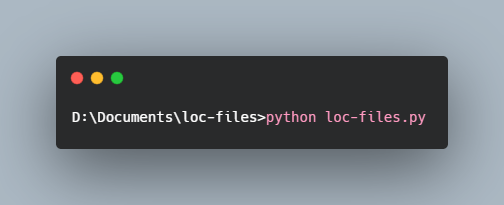

# loc-files

I created this small code when you need to create bunch of loc files for your sign files for Trackmania. Sadly you still have to fill them manually

## Tutorial

### Python version

1. Go to your terminal, type `py` and press Enter

2. You'll get this message or other version confirmation

3. If you don't get this message, you need to download Python from its [offical site](https://www.python.org/downloads/)

### Editing the file

1. You just need the .py file, open it with a text editor

2. You have to edit 2 sections

    1. You have to change `source_folder` for your folder where you have your signs

    2. You have to edit `dest_folder` with the same as `source_folder`

    

3. Save your changes

### Running the code

1. Open your terminal and navigate to the folder where you have the .py file with `cd`

2. When you're on the folder, you can run the code. You have to type `python loc-files.py` and press Enter

3. If you don't get any message, it worked and you should have your loc files next to your original files

4. If you get an error, read it and try to fix it. Usually there're problem with the folder routes